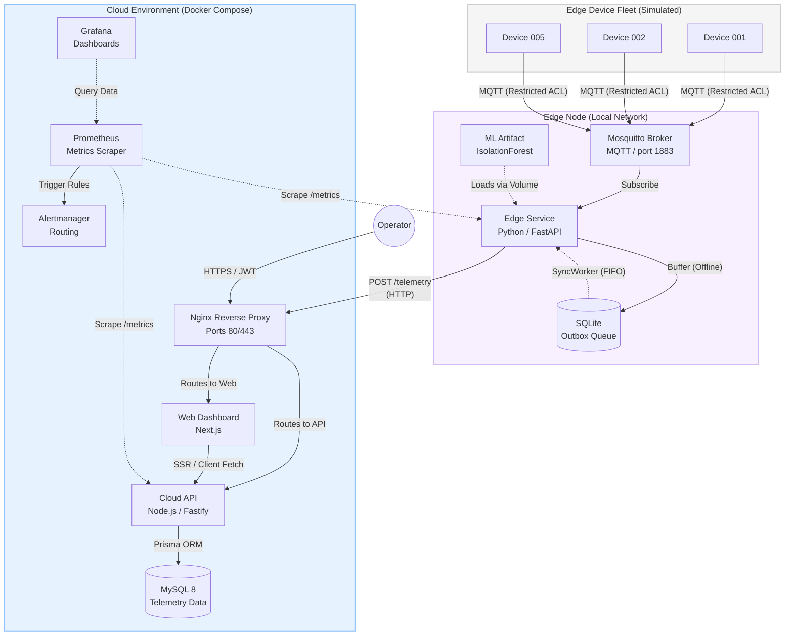

# EdgeSentinel System Architecture

This document defines the final production architecture for the EdgeSentinel platform, detailing the flow of data, component responsibilities, and security boundaries.

## 1. High-Level Architecture Diagram

## 2. Component Responsibilities & Security Boundaries

### 2.1 The Edge Layer
* **IoT Fleet (Simulator):** Generates noisy baseline telemetry mimicking industrial sensors. **Security:** Completely isolated. Clients can only write to their own specific MQTT topic (e.g., `edgesentinel/devices/DEVICE-001/telemetry`) and cannot subscribe to others.
* **Mosquitto MQTT Broker:** Serves as the ingestion gateway on the edge network. Enforces the strict ACLs.
* **Edge Service (Python):** The brain of the local node. It subscribes to the broker, runs real-time ML inference (loading versioned `.joblib` models from disk), and dynamically routes data based on actual host CPU and API network latency.
* **SQLite Outbox:** Provides offline-first resilience. If the cloud is unreachable, the Edge Service buffers telemetry here and replays it in FIFO order once connectivity is restored.

### 2.2 The Cloud Layer
* **Nginx Reverse Proxy:** The single entry point to the cloud environment. Handles SSL termination and routes external traffic to the Web Dashboard or Cloud API, completely hiding internal service ports.
* **Cloud API (Node.js/Fastify):** The central data ingest and control plane. **Security:** Hardened with Helmet, CORS restrictions, global rate-limiting, and JWT-based Role-Based Access Control (RBAC). 
* **MySQL 8:** The primary persistent store. Optimized with composite descending indexes on the `telemetry` table to handle high-throughput time-series pagination queries.
* **Web Dashboard (Next.js):** Provides operators with a responsive, server-side rendered interface to visualize anomalies and manage edge devices in real-time.

### 2.3 The Observability Stack
* **Prometheus:** Scrapes `/metrics` endpoints from both the Edge Service and Cloud API every 15 seconds.
* **Grafana:** Visualizes metrics via pre-provisioned dashboards (e.g., "Edge Reliability Dashboard").
* **Alertmanager:** Evaluates rules (like `ApiDown` or `HighErrorRate`) and routes alerts to external channels (e.g., Slack or Email) when system objectives are breached.

## 3. Network Architecture
All cloud components run within an isolated Docker bridge network (`edgesentinel-network`). Services resolve each other by container name (e.g., `http://cloud-api:3000`). Only Nginx (`:80`, `:443`) and Grafana (`:3002` for internal monitoring) are bound to the host network interface. MySQL is heavily protected and never exposed to the public internet.
